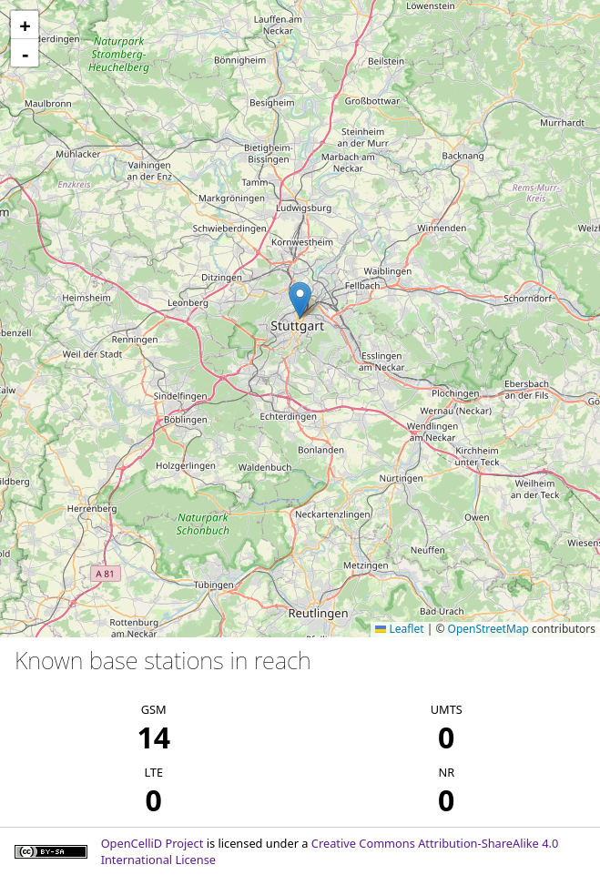
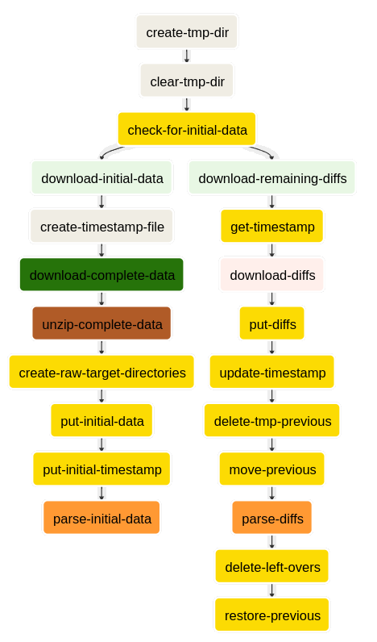

# Cell coverage checker

Small tool to check for cell towers in reach for a given location.
The coverage data for this is provided and licensed by the [OpenCellID-Project](https://opencellid.org/).



This tool was created for the lecture [“Big Data”](https://github.com/marcelmittelstaedt/BigData) held
by [@marcelmittelstaedt](https://github.com/marcelmittelstaedt) at the [DHBW Stuttgart](https://dhbw-stuttgart.de/).

## Starting the service locally

The service can be started through [Docker Compose](https://docs.docker.com/compose/) or a compatible tool.

```shell
# Make sure you are inside of the project root
docker-compose up
```

After this, the [user application](http://localhost:3030), [airflow](http://localhost:8080),
[hadoop task overview](http://localhost:8088), and the
[hadoop file viewer](http://localhost:9870/explorer.html) should be reachable.

If you need to access other services like the frontend application database, make sure to apply the development service
configuration.

```shell
docker-compose -f docker-compose.yml -f docker-compose.dev.yml up
```

## Data collection workflow

The [ETL](https://en.wikipedia.org/wiki/Extract%2C_transform%2C_load) process is implemented in
[Airflow](https://airflow.apache.org/).
The general idea is to check the current state of the data within the Hadoop file system and perform the actions 
accordingly.
For example, if the initial full OpenCellID export is already downloaded, download the remaining difference files instead.
The state of the data is tracked with a separate timestamp file, which marks the last time the data was gathered.

OpenCellID provides additional attributes for each entry, which are not relevant for the frontend application but are
required to identify the entries when merging the data states.
Therefore, those extra attributes are reduced to their hash, providing a unique identifier.
The final dataset includes only the location and the range of the station, and this identifier. 



| Task                            | Description                                                                                                |
|---------------------------------|------------------------------------------------------------------------------------------------------------|
| `create-tmp-dir`                | Create a directory to stage the downloaded files in.                                                       |
| `clear-tmp-dir`                 | Delete existing files within the download staging directory if any exists.                                 |
| `check-for-initial-data`        | Check for a download of a full OpenCellID export.                                                          |
|                                 |                                                                                                            |
| `download-initial-data`         | Label the initial download branch, which gets executed if the previous check fails.                        |
| `create-timestamp-file`         | Create the data timestamp file within the download staging directory.                                      |
| `download-complete-data`        | Download the full OpenCellID export archive.                                                               |
| `unzip-complete-data`           | Extract the full OpenCellID export from its archive.                                                       |
| `create-raw-target-directories` | Create the final destination for the downloaded files within the Hadoop file system.                       |
| `put-initial-data`              | Upload the full OpenCellID export to the Hadoop file system.                                               |
| `put-initial-timestamp`         | Upload the timestamp file to the Hadoop file system.                                                       |
| `parse-initial-data`            | Transform the initial data and save it to the Hadoop file system and the frontend application database.    |
|                                 |                                                                                                            |
| `download-remaining-diffs`      | Label the difference download branch, which gets executed if the previous check succeeds.                  |
| `get-timestamp`                 | Download the timestamp of the current data state from the Hadoop file system.                              |
| `download-diffs`                | Download all difference files from OpenCellID since the data timestamp.                                    |
| `put-diffs`                     | Upload the downloaded difference files to the Hadoop file system.                                          |
| `update-timestamp`              | Override the timestamp file with the new timestamp for the data.                                           |
| `delete-tmp-previous`           | Delete temporary data storage if it exists.                                                                |
| `move-previous`                 | Move the data storage to the temporary directory for processing.                                           |
| `parse-diffs`                   | Merge the existing data with the new data provided by the difference files and override the existing data. |
| `delete-left-overs`             | Clear the final data location. Gets executed when the previous step failed.                                |
| `restore-previous`              | Move the previous data to its final destination. Gets executed if the previous step succeeded.             |